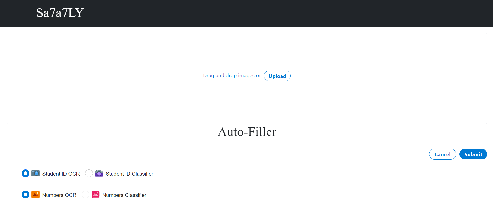
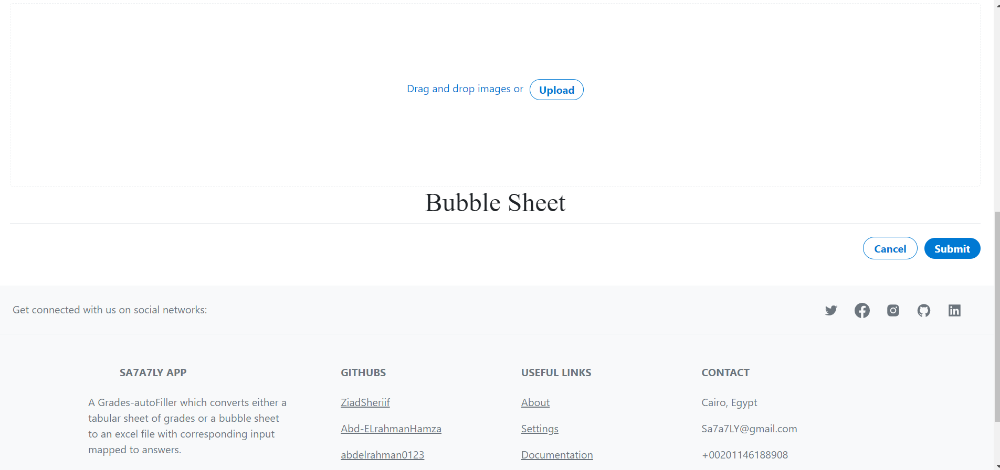
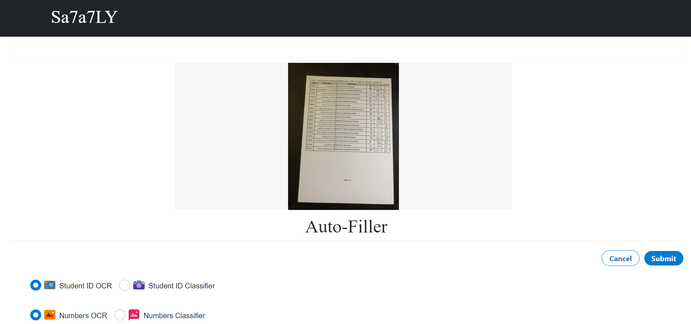
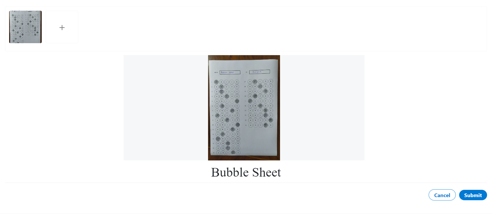

<!--  TODO: add requirments file and demo video -->
<div align="center">
<a href="https://github.com/ZiadSheriif/SA7A7LY" rel="noopener">

</a>

</div>

<div align="center">
 
[](https://github.com/ZiadSheriif/SA7A7LY/contributors)
[](https://github.com/ZiadSheriif/SA7A7LY/issues)
 [](LICENSE)
[](https://github.com/ZiadSheriif/SA7A7LY/network)
[](https://github.com/ZiadSheriif/SA7A7LY/stargazers)
[](https://img.shields.io/github/languages/count/ZiadSheriif/SA7A7LY)

</div>

## 📝 Table of Contents

- [📝 Table of Contents](#-table-of-contents)
- [📙 About ](#-about-)
- [🏁 Getting Started ](#-getting-started-)
  - [Prerequisite ](#prerequisite-)
  - [Installation ](#installation-)
  - [Running ](#running-)
- [💻 Built Using ](#-built-using-)
- [📷 Demo Screenshots ](#-demo-screenshots-)
- [📷 Demo Video ](#-demo-video-)
- [Contributors ](#contributors-)
- [License ](#license-)

## 📙 About <a name = "about"></a>

- A Grades-autoFiller which converts either a tabular sheet of grades or a bubble sheet to an excel file with corresponding input mapped to answers.


## 🏁 Getting Started <a name = "get-started"></a>

> This is an list of needed instructions to set up your project locally, to get a local copy up and running follow these
> instructuins.

### Prerequisite <a name = "req"></a>

1. python 3.9.2
2. pytesseract
3. React JS
4. Node JS

### Installation <a name = "Install"></a>

 **_Clone the repository_**

```sh
$ git clone https://github.com/ZiadSheriif/Sa7a7LY
```

### Running <a name = "running"></a>

**_Running program_**

1. run back-end server
```sh
npm start 
```

2.  run front-end server
```sh
npm start gui/src/
```

## 💻 Built Using <a name = "tech"></a>

- **Python**

## 📷 Demo Screenshots <a name = "Screenshots"></a>

<div align="center">
<h3 align='left'>Main Screen</h3>
   
<h3 align='left'>Auto-Filler</h3>
   </a>

<h3 align='left'>Bubble Sheet</h3>
</a>
<h3 align='left'>Preview auto filler</h3>
</a>
<h3 align='left'>Preview bubble sheet</h3>
</a>

</div>
## 📷 Demo Video <a name = "video"></a>
<div align="center">

</div>

## Contributors <a name = "Contributors"></a>

<table>
  <tr>
    </td>
    <td align="center">
    <a href="https://github.com/ZiadSheriif" target="_black">
    
    <br />
    <sub><b>Ziad Sherif</b></sub></a>
    </td>
   <td align="center">
    <a href="https://github.com/abdelrahman0123" target="_black">
    
    <br />
    <sub><b>Abdelrahman Hamdy</b></sub></a>
    </td>
    <td align="center">
    <a href="https://github.com/Abd-ELrahmanHamza" target="_black">
    
    <br />
    <sub><b>Abdelrahman Mohamed</b></sub></a>
    </td>
   <td align="center">
    <a href="https://github.com/Ahmedsabry11" target="_black">
    
    <br />
    <sub><b>Ahmed Sabry</b></sub></a>


  </tr>
 </table>

## License <a name = "license"></a>

> This software is licensed under MIT License, See [License](https://github.com/ZiadSheriif/SA7A7LY/blob/main/LICENSE) for more information ©ZiadSheriif.
