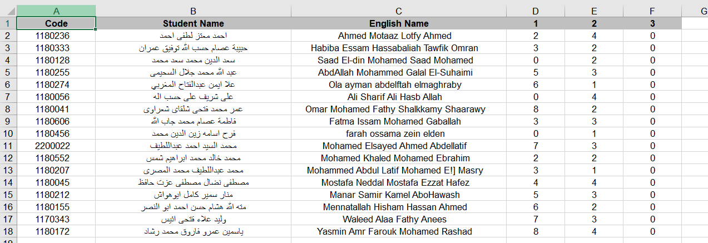

<!--  TODO: add requirments file and demo video -->
<div align="center">
<a href="https://github.com/ZiadSheriif/SA7A7LY" rel="noopener">

</a>

</div>

<div align="center">
 
[](https://github.com/ZiadSheriif/Sa7a7LY/contributors)
 [](LICENSE)
[](https://github.com/ZiadSheriif/Sa7a7LY/network)
[](https://github.com/ZiadSheriif/Sa7a7LY/stargazers)
[](https://img.shields.io/github/languages/count/ZiadSheriif/Sa7a7LY)

</div>

## 📝 Table of Contents

- [📝 Table of Contents](#-table-of-contents)
- [📙 About ](#-about-)
- [💡 Explanation ](#-explanation-)
  - [For the grades sheet:](#for-the-grades-sheet)
    - [For the student ID and hand-written numbers](#for-the-student-id-and-hand-written-numbers)
- [🏁 Getting Started ](#-getting-started-)
  - [Prerequisites ](#prerequisites-)
  - [Installation ](#installation-)
  - [Running ](#running-)
- [💻 Built Using ](#-built-using-)
- [📷 Demo Screenshots ](#-demo-screenshots-)
- [🎥 Demo Videos ](#-demo-videos-)
- [🕴 Contributors ](#-contributors-)
- [📃 License ](#-license-)

## 📙 About <a name = "about"></a>

- A Grades-autoFiller which converts either a tabular sheet of grades or a bubble sheet to an excel file with corresponding input mapped to answers.

## 💡 Explanation <a name = "explanation"></a>

### For the grades sheet:

- Check marks are translated to 5
- Question marks give a red background in its excel cell
- A box is mapped to 0 score
- Stacked vertical lines are written by their count
- Stacked horizontal lines are written by 5 - their count

#### For the student ID and hand-written numbers

- Two approaches are implemented:
  1.  Already-made OCR
  2.  Features + classifier
- The user chooses which method to convert them by selecting an option from two below uploading the image.

## 🏁 Getting Started <a name = "get-started"></a>

> This is a list of needed instructions to set up your project locally, to get a local copy up and run the below
> commands.

### Prerequisites <a name = "req"></a>

1. python 3.9.2
2. pytesseract
3. OpenCv
4. matplotlib
5. numpy
6. PTL
7. ReactJs
8. NodeJs

### Installation <a name = "Install"></a>

1. **_Clone the repository_**

```sh
 git clone https://github.com/ZiadSheriif/Sa7a7LY
```
2. **_Navigate to Sa7a7LY Folder_**
```sh
cd Sa7a7LY
```

### Running <a name = "running"></a>

**_Running program_**
   1. Install modules
```sh
npm install
```

2. Run back-end 

```sh
npm start
```

3.  Run front-end 
   
  ```sh
  npm start gui/src
  ```

## 💻 Built Using <a name = "tech"></a>

- **Python**
- **NodeJs**
- **ReactJs**

## 📷 Demo Screenshots <a name = "Screenshots"></a>

<div align="center">
<h3 align='left'>Main Screen</h3>
   
 <h3 align='left'>Input Auto-Filler</h3>
</a>
<h3 align='left'>Output Auto-Filler</h3>
</a>
</div>
<hr>

## 🎥 Demo Videos <a name = "Videos"></a>

<div align="center">

<h3 align="left">Grades Sheet</h3>


<h3 align="left">Bubble Sheet</h3>


</div>
<hr>

## 🕴 Contributors <a name = "Contributors" ></a>

<table>
<tr>
  </td>
  <td align="center">
  <a href="https://github.com/ZiadSheriif" target="_black">
  
  <br />
  <sub><b>Ziad Sherif</b></sub></a>
  </td>
 <td align="center">
  <a href="https://github.com/AbdelrahmanHamdyy" target="_black">
  
  <br />
  <sub><b>Abdelrahman Hamdy</b></sub></a>
  </td>
  <td align="center">
  <a href="https://github.com/Abd-ELrahmanHamza" target="_black">
  
  <br />
  <sub><b>Abdelrahman Hamza</b></sub></a>
  </td>
 <td align="center">
  <a href="https://github.com/Ahmedsabry11" target="_black">
  
  <br />
  <sub><b>Ahmed Sabry</b></sub></a>

</tr>
 </table>

## 📃 License <a name = "license"></a>

> This software is licensed under MIT License, See [License](https://github.com/ZiadSheriif/SA7A7LY/blob/main/LICENSE) for more information @SA7A7LY.
